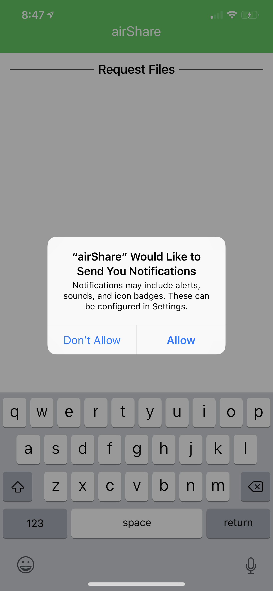

# AirShare

## Summary

This app was developed for a networking class.  A few friends and I wanted to build a cross platform File Transfer App.  

## How it works

Firstly, once the app is downloaded 



## Run the project

### Prerequisites

The only dependency is that you install [BSImagePicker](https://github.com/mikaoj/BSImagePicker). BSImagePicker is available through CocoaPods. To install it, simply add the following line to your Podfile:

```ruby
pod "BSImagePicker", "~> 2.8"
```

