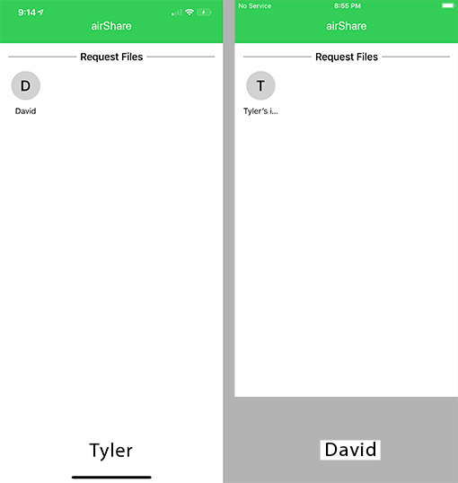
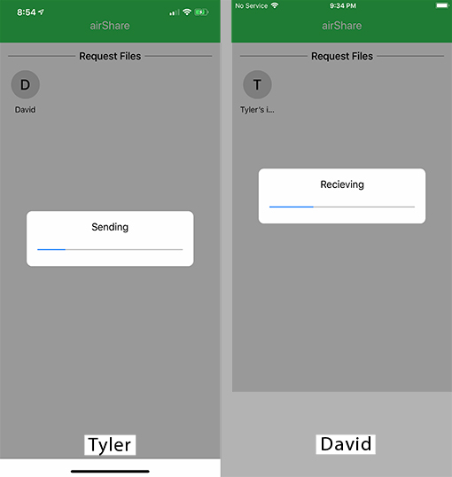
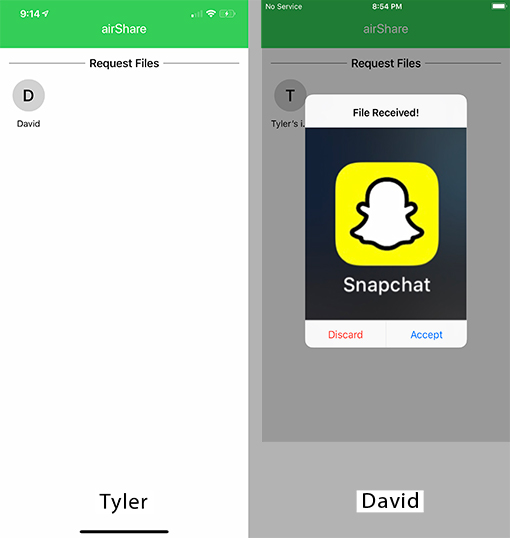

# AirShare

## Summary

This app was developed for a networking class.  A few friends and I wanted to build a cross platform File Transfer App.  I mostly worked on the iPhone version while some others worked on the Android version found [here](https://github.com/benmohan77/BluetoothFileTransfer-Android)  

*This app is not on the Appstore and will need to be installed, compiled, and ran manually with xcode*

## How it works

Once two people have the app downloaded, they will see eachother on the main screen.  



If *David* were to tap on *Tyler* then it will show this.


*Tyler* can accept or decline the file request, if he accepts then it will have him pick an image to send.


Once *Tyler* selects an image, it will begin transferring to *David's* device.



When the transfer is done, *David* will have the image on his phone.



## What we learned

- iOS is not meant to transfer moderately sized data to non-iPhones
- Bluetooth LE is not meant to transfer large files (it still will, just slowly)
- Networking to other devices is kind of finicky
- BLE can transfer data over a large distance (up to a football field in length)

## Run the project yourself

### Prerequisites

The only dependency is that you install [BSImagePicker](https://github.com/mikaoj/BSImagePicker). BSImagePicker is available through CocoaPods. To install it, simply add the following line to your Podfile:

```ruby
pod "BSImagePicker", "~> 2.8"
```

### Key Notes:
 
- This app is also pretty buggy
- This app only transmits Images
- The images transmit slowly :\

